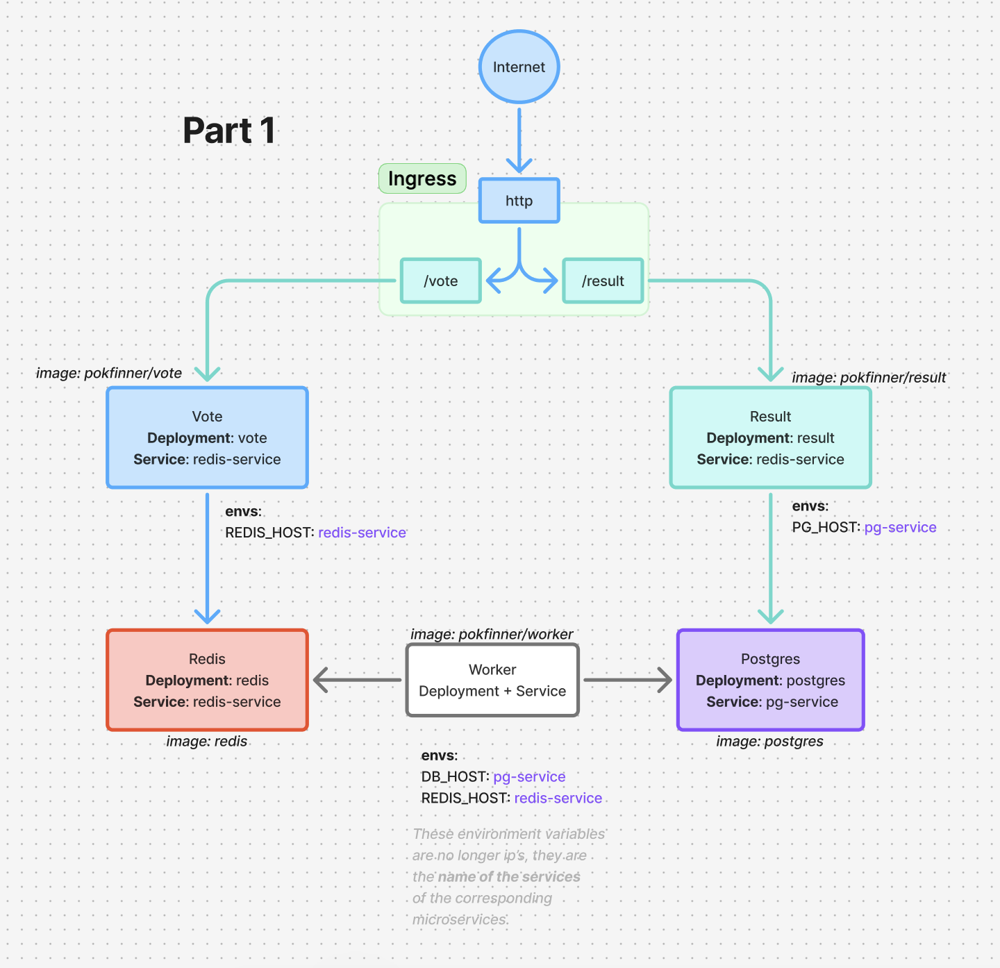
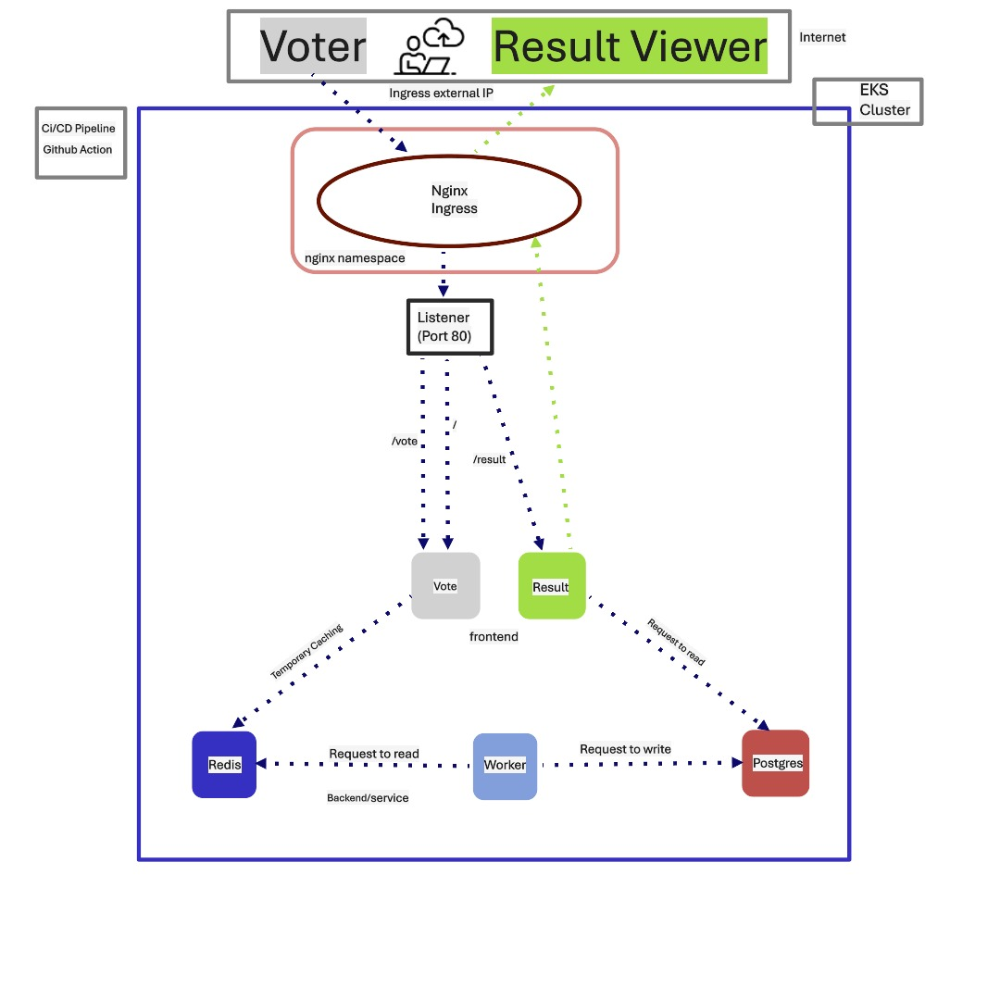

# EKS-based-microservice-apps-automation
This project is a simplified voting application deployed on Amazon EKS (Elastic Kubernetes Service). It includes a voting interface and result viewer, integrated with a backend Redis/PostgreSQL system. Deployment is fully automated using GitHub Actions CI/CD.

# ⚙️ Architecture Overview

# The app consists of:

    - Frontend Clients:

        - Voter (/vote) – Cast a vote

        - Result Viewer (/result) – Display live results

    - Backend Services:

        - Redis – Acts as a temporary cache to store incoming votes

        - PostgreSQL – Stores final vote counts permanently

        - Worker – Background service that transfers data from Redis to PostgreSQL

    - Ingress Controller:

        - NGINX Ingress exposes a single endpoint with routing to /vote and /result

        - Ingress Listener on port 80

# 🚀 Deployment Workflow
    - Infrastructure Setup: EKS cluster is provisioned (automated with Terraform)

        - CI/CD Pipeline:

            - GitHub Actions builds and pushes Docker images to a registry

            - Kubernetes manifests are applied for deployment

    - Ingress Routing:

        - All external traffic comes through the NGINX Ingress Controller

            - Routes:

                - /vote → Vote frontend

                - /result → Result frontend
                
                - / → default to vote frontend

    - Data Flow:

        - User casts a vote → Vote stored temporarily in Redis

        - Worker service reads from Redis and writes to PostgreSQL

        - Result Viewer reads from PostgreSQL to display current tally

# 🔐 Security Practices
    - Only Ingress Controller is publicly exposed via EKS Load Balancer

    - Communication between services is handled internally within the EKS cluster

    - No hardcoded credentials or sensitive data in the codebase

    - Secrets are managed via Kubernetes Secrets

    - 🔧 Environment Variables - Each component uses its own set of variables, examples:

        - vote and result frontends: REACT_APP_API_BASE=http://<ingress-ip>

        - worker service:
        - REDIS_HOST=redis,
        - REDIS_PORT=6379,
        - POSTGRES_HOST=postgres,
        - POSTGRES_PORT=5432,
        - POSTGRES_USER=admin,
        - POSTGRES_PASSWORD=secret.
